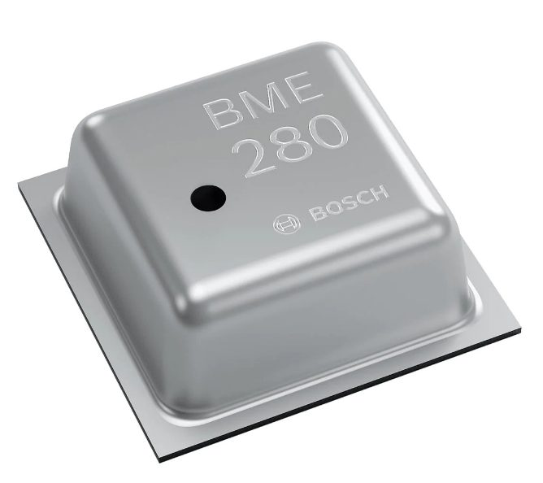

# wokwi-bme280-custom-chip

- [bme280 chip data sheet](https://www.bosch-sensortec.com/media/boschsensortec/downloads/datasheets/bst-bme280-ds002.pdf)

The bme280 Custom Chip simulates the Bosch Sensortec Sensor of the same name. 

The chip has the following pin groups

| Name         | Description                                            |
| ------------ | ------------------------------------------------------ |
| `Vdd`   | Power pin          |
| `Vddio`   | Power pin for digital interface supply          |
| `GND`     | ground pin                        |
| `SDI`      | Data In Pin, used as input only pin           |
| `SDO`      | Data Out Pin, used as output only pin           |
| `SCK`      | Clock Pin, used as input only pin           |
| `CS`      | Chip Select Pin, used as input only pin           |

### Addressing
The device uses Chip Select to detect whether it is addressed

### SPI Comms 
The device uses SPI for comms with the MCU. 

## Implementation details
This chip supports all the functions of the hardware part. Commands are listed below

### Reset 
Write only. Resets the chip to power on. 

## Attributes
The chip defines a number of attributes that alter the behavior of the  operation when used in Wokwi. 

| Name         | Description                                            | Default value             |
| ------------ | ------------------------------------------------------ | ------------------------- |
| `debug`   |  controls debug output for the implementation code | `"0"`                 |
| `standby_time`   |  timer duration used in normal mode. Values can range between 0.5 and 1000ms | `"100"`                 |
| `iir_enabled`   |  controls iir filter behaviour. Can be 0 (disabled) or 1 (enabled) | `"0"`                 |

## Simulator examples

- [bme280 Custom Chip TBD ](https://wokwi.com/projects/350278641316266578)

##  Limitations and ommissions

### Detection of Vddio
As per the spec 
> It is prohibited to keep any interface pin (SDI, SDO, SCK or CSB) at a logical high level when VDDIO is
> switched off. Such a configuration can permanently damage the device due an excessive current flow through the ESD protection diodes. 

The implementation only checks this at initialisation time now and will 
not function should this condition occur. Error is shown in the logs

### Cycling Vdd
As per the spec 
> If VDDIO is supplied, but VDD is not, the interface pins are kept at a high-Z level. The bus can therefore
> already be used freely before the BME280 VDD supply is established. 

The implementation only checks this at initialisation time now.s

### SPI Implementation
As per the spec, the chip supports 3 and 4 wire SPI. Current implementation uses 4-wire

> Note: For now, only SPI is supported